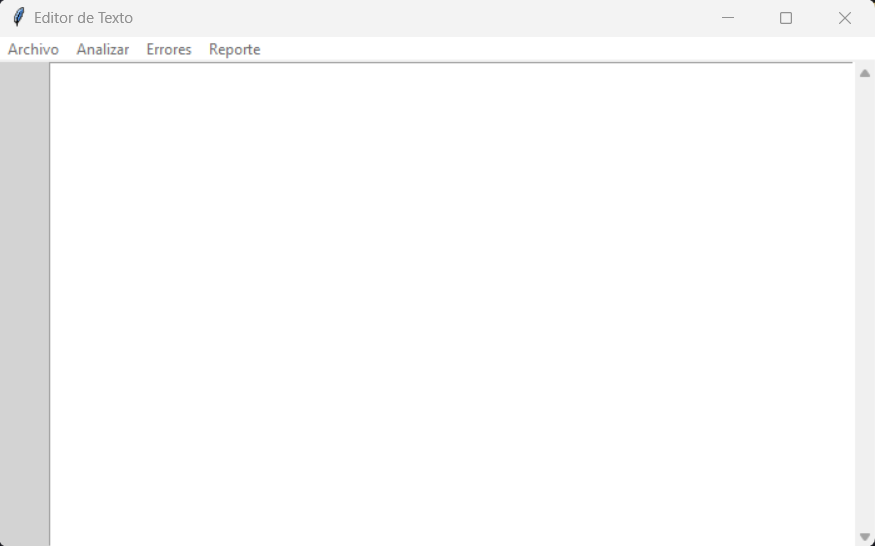

#Manual de usuario
##Interfaz
Para empezar tenemos el editor de texto con varias opciones el la parte superior:

En archivo se nos extinden varias opciones:

- **Abrir:** Con esta opción te permitirá elegir un archivo .json de tus archivos para abrirlo en el editor de texto.
- **Guardar:** Con esta opción te permitirá guardar el archivo .json abierto posteriormente. Si no se ha abierto nunguno, lo creará.
- **Guardar Como:** Con esta opción te permitirá guardar el archivo .json como nuevo archivo.
- **Salir:** Salir del programa.

El formato del archivo .json es el siguiente:
```
{ 
    "Operaciones":[
{
"Operacion":"Suma",
"Valor1":4.5,
"Valor2":5.32
},
{
    "Operacion":"Suma",
    "Valor1":4.5,
    "Valor2":[
        {
        "Operacion":"Seno",
        "Valor1":14
        }
    ]
}
],
        
"Configuraciones":[
    {
    "texto":"Operaciones",
    "color-fondo-nodo":"azul",
    "color-fuente-nodo":"negro",
    "forma-nodo":"circulo"	
    }	
]
}
```

Donde se debe especificar la operación a realizar, el o los valores a operar y las configuraciones de los colores, formas y fuentes de las gráficas. Se pueden convinar operaciones como se ve en el ejemplo.
Las operaciones que se pueden realizar con el programa se dividen en dos grupos:
- Aritméticas
    - Suma
    - Resta
    - Multiplicación
    - Division
    - Potencia
    - Raiz
    - Mod
- Trigonométricas
    - Inverso
    - Seno
    - Coseno
    - Tangente

##Analizar
Al haber ingresado correctamente todos los datos (sin errores aritmeticos) y darle al botón "Analizar" se presentará la siguiente ventana con los resultados de las operaciones ingresadas:

##Errores
En caso de haber ingresado datos que no pertenecen al formato estandar (errores léxicos) estos se guardarán y se podrán solicitar en el botón "Errores" donde se generará un archivo llamado Errores.JSON.
A continuación se prsentan unos ejemplos de errores y del archivo .json:

```
        {*
        "Operacion":"Suma",
        "Valor1":4.5,
        "Valor2":5.32
        },
        {?
        "Operacion":"Suma",
        "Valor1":4.5,
        "Valor2":5.32
        },
```
Los errores de este archivo generan el siguiente archivo de errores:
```
        {
            "errores":[
        {
                          "No":1,
                          "descripcion":{
                          "lexema":"*",
                          "tipo": "error lexico",
                          "columna":14,
                          "fila":3
                          }
            },
{
                          "No":2,
                          "descripcion":{
                          "lexema":"?",
                          "tipo": "error lexico",
                          "columna":10,
                          "fila":8
                          }
            }
]
                      }
```
Donde indica el numero de errores, el lexema del error, la fila y la columna.
##Reporte
En este apartado se generará un archivo llamado Operaciones.dot que a su vez generará un archivo llamado Operaciones.svg el cual tendrá una o varias gráficas con las diferentes operaciones realizadas. a continuación se muestra el formato de las gráficas:

donde el resultado se encuentra en la parte superior, el nombre de la operación que se realizó en la parte del centro y el o los valores que se utilizaron en la parte inferior.